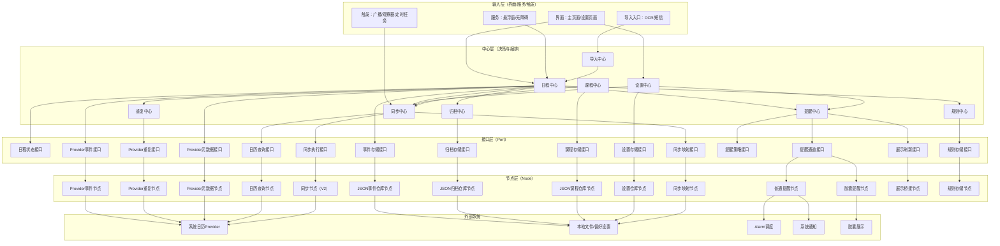
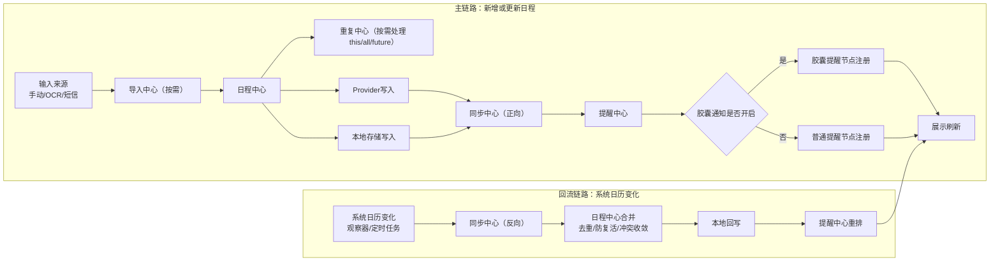
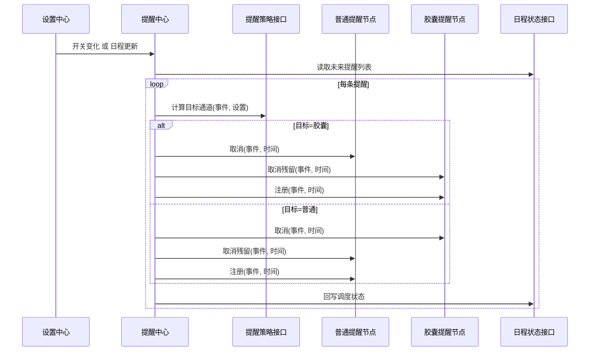
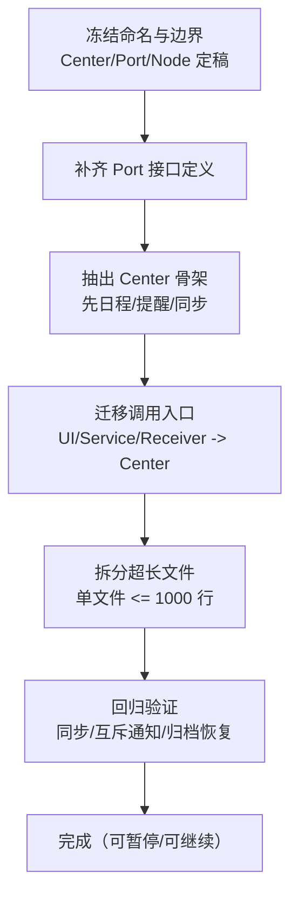

# 2026-04-16 Center-Port-Node 架构定稿

## 一、文档目的

本文件用于冻结当前重构方向，作为后续是否继续推进的统一基线。

- 有时间：按本方案逐步落地。
- 没时间：保持现状，后续可直接从本文件恢复上下文继续。

---

## 二、核心决议（最终）

采用 **Center -> Port -> Node** 三层结构：

- **Center**：业务决策与流程编排层。
- **Port**：能力边界接口层（Center 仅依赖接口，不依赖实现）。
- **Node**：基础设施与执行层（Provider/JSON/通知/胶囊/Worker/Receiver 等）。

### 强制调用方向

`UI/Service/Receiver -> Center -> Port -> Node`

禁止跨层直连：

- UI/Service/Receiver 直接调用 Node：禁止。
- Center 直接依赖具体 Node：禁止（必须经 Port）。

---

## 三、必须遵守的不变量

### 1) 通知互斥（硬约束）

同一事件同一触发时刻，**只能走一种通知通道**：

- 普通通知（Standard）
- 胶囊通知（Capsule）

互斥规则固定由 `ReminderCenter` 决策，且执行顺序固定：

1. 先取消两侧残留（standard + capsule）
2. 再注册目标通道
3. 回写调度状态

### 2) 数据契约稳定

- `Events.SYNC_DATA1`：ProviderSyncData（状态元数据）
- `Events.SYNC_DATA2`：appEventId(UUID)

### 3) 文件规模约束

- 单文件硬上限：1000 行
- 建议预警线：700 行（超过后进入拆分计划）

---

## 四、Center 定稿清单

1. `ScheduleCenter`
   - 日程根中心，对外统一入口
   - 负责增删改查、完成/撤销、undo、规则动作编排

2. `RecurringCenter`
   - 负责 this/all/future、detach、exception 生命周期

3. `ArchiveCenter`
   - 负责归档/恢复/永久删除/自动归档

4. `ReminderCenter`
   - 负责提醒策略与注册重排
   - 负责普通通知与胶囊通知互斥决策

5. `SyncCenter`
   - 负责正向/反向同步编排、映射清理、冲突收敛

6. `CourseCenter`
   - 负责课程增删改与课表联动

7. `ImportCenter`
   - 负责 OCR/SMS/Wakeup 导入统一入口

8. `SettingsCenter`
   - 负责设置更新与副作用联动（天气、提醒重排、观察者联动）

9. `RuleCenter`
   - 负责规则配置与运行时绑定

---

## 五、Port 定稿清单

1. `ScheduleStatePort`
   - events/archived/courses/settings 的 Flow 暴露与原子更新

2. `EventStorePort`
   - 活跃日程本地持久化

3. `ArchiveStorePort`
   - 归档本地持久化

4. `CourseStorePort`
   - 课程本地持久化

5. `SettingsStorePort`
   - 设置持久化

6. `SyncMappingPort`
   - 同步映射读写（local <-> system）

7. `RuleStorePort`
   - 规则/状态/迁移读写

8. `ProviderEventPort`
   - Provider 单事件 CRUD + 快照/实例查询

9. `ProviderRecurringPort`
   - 重复事件 this/all/future/split/delete

10. `ProviderMetaPort`
    - 重要性/归档态/交通态/规则态回写

11. `ProviderArchivePort`
    - Provider 归档相关物理动作

12. `CalendarQueryPort`
    - 系统日历查询（日历列表、区间事件、实例、series）

13. `CalendarSyncPort`
    - 正/反向同步执行能力

14. `ReminderPolicyPort`
    - 提醒通道决策（STANDARD/CAPSULE）

15. `ReminderChannelPort`
    - 通道接口（register/cancel/reschedule）

16. `LiveSurfacePort`
    - 胶囊/浮层展示刷新触发

---

## 六、Node 定稿清单（按现有代码映射）

### 1) 存储节点

- `JsonEventStoreNode` -> `app/src/main/java/com/antgskds/calendarassistant/data/repository/EventRepository.kt`
- `JsonArchiveStoreNode` -> `app/src/main/java/com/antgskds/calendarassistant/data/repository/ArchiveRepository.kt`
- `JsonCourseStoreNode` -> `app/src/main/java/com/antgskds/calendarassistant/data/repository/CourseRepository.kt`
- `SettingsStoreNode` -> `app/src/main/java/com/antgskds/calendarassistant/data/repository/SettingsRepository.kt`
- `SyncMappingNode` -> `app/src/main/java/com/antgskds/calendarassistant/data/repository/SyncMappingRepository.kt`
- `RuleStoreNode` -> `app/src/main/java/com/antgskds/calendarassistant/core/rule/RuleStore.kt`

### 2) Provider 节点

- `ProviderEventNode` -> `app/src/main/java/com/antgskds/calendarassistant/core/calendar/provider/EventStore.kt`
- `ProviderRecurringNode` -> `app/src/main/java/com/antgskds/calendarassistant/core/calendar/provider/RecurringEditor.kt`
- `ProviderMetaNode` -> `app/src/main/java/com/antgskds/calendarassistant/core/calendar/provider/MetaPort.kt`
- `ProviderCompletionNode` -> `app/src/main/java/com/antgskds/calendarassistant/core/calendar/provider/CompletionPort.kt`
- `ProviderArchiveNode` -> `app/src/main/java/com/antgskds/calendarassistant/core/calendar/provider/ArchivePort.kt`
- `ProviderMetaCacheNode` -> `app/src/main/java/com/antgskds/calendarassistant/core/calendar/provider/EventMetaStore.kt`

### 3) 同步节点

- `CalendarQueryNode` -> `app/src/main/java/com/antgskds/calendarassistant/core/calendar/CalendarManager.kt`
- `CalendarSyncNode` -> `app/src/main/java/com/antgskds/calendarassistant/core/calendar/CalendarSyncManagerV2.kt`
- `SyncGatewayNode` -> `app/src/main/java/com/antgskds/calendarassistant/core/calendar/CalendarSyncGateway.kt`

### 4) 通知与展示节点

- `StandardReminderNode` ->
  - `app/src/main/java/com/antgskds/calendarassistant/service/notification/NotificationScheduler.kt`
  - `app/src/main/java/com/antgskds/calendarassistant/service/receiver/AlarmReceiver.kt`
- `CapsuleReminderNode` -> `app/src/main/java/com/antgskds/calendarassistant/core/capsule/CapsuleStateManager.kt`
- `LiveSurfaceNode` -> `app/src/main/java/com/antgskds/calendarassistant/core/calendar/provider/LiveSurfaceBridge.kt`

### 5) 输入与触发节点

- `SmsIngressNode` ->
  - `app/src/main/java/com/antgskds/calendarassistant/core/sms/SmsImportCoordinator.kt`
  - `app/src/main/java/com/antgskds/calendarassistant/core/sms/SmsContentObserver.kt`
- `OcrIngressNode` -> `app/src/main/java/com/antgskds/calendarassistant/core/ai/RecognitionProcessor.kt`
- `SystemTriggerNode` ->
  - `app/src/main/java/com/antgskds/calendarassistant/core/calendar/CalendarContentObserver.kt`
  - `app/src/main/java/com/antgskds/calendarassistant/core/calendar/CalendarReverseSyncWorker.kt`
  - `app/src/main/java/com/antgskds/calendarassistant/service/receiver/`

---

## 七、当前已完成与后续边界

### 已完成（方向正确）

- 日程 Provider 操作已具备 Port 化雏形：
  - `EventStore`
  - `RecurringEditor`
  - `CompletionPort`
  - `MetaPort`
  - `ArchivePort`
- 单实例策略接口化已存在：`RecurringInstanceAction`

### 后续要做（有时间再做）

- 将现有 Port 类补齐为接口 + 实现分离
- 将 `AppRepository` 拆分为多个 Center
- 将 UI/Service/Receiver 调用入口统一收口到 Center

---

## 八、执行优先级（可选）

P0（优先）：

1. 拆 `AppRepository` -> `ScheduleCenter/RecurringCenter/ArchiveCenter/ReminderCenter/SyncCenter`
2. 固化提醒互斥链路（ReminderCenter 唯一决策）
3. 保证 `SYNC_DATA1/SYNC_DATA2` 读写口径一致

P1（随后）：

1. 拆 `CalendarSyncManagerV2`
2. 拆 `CalendarManager`
3. 清理 UI 与 Service 对具体仓库实现的直接依赖

---

## 九、状态结论

本方案即日起视为“结构定稿文档”。

- 暂不强制立即实施。
- 任何后续重构若与本文件冲突，应先更新本文件再改代码。

---

## 十、架构与流程图（Mermaid）

说明：可直接复制以下代码到 Mermaid 在线编辑器（如 mermaid.ai）查看。

### 1) 架构总图（Center -> Port -> Node）

### 2) 主流程图（新增/更新 + 反向同步）

### 3) 提醒互斥时序图

### 4) 重构推进图（可暂停）

